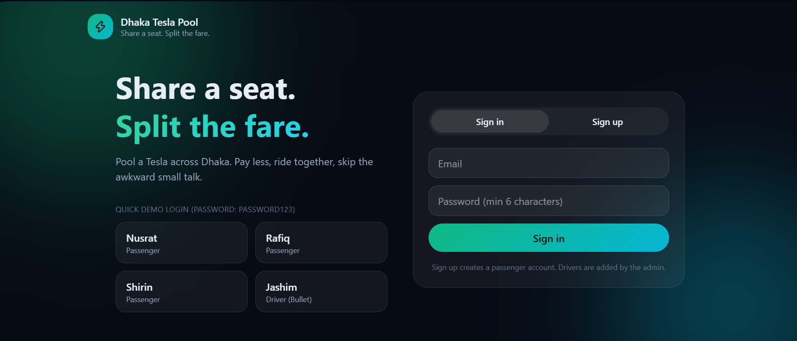
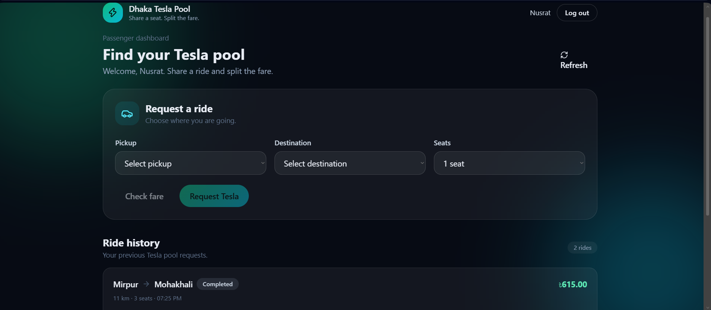
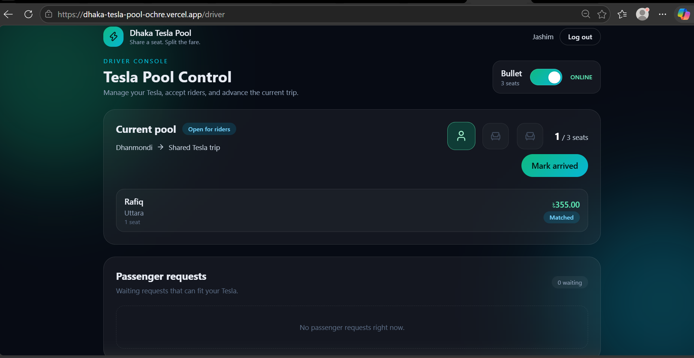
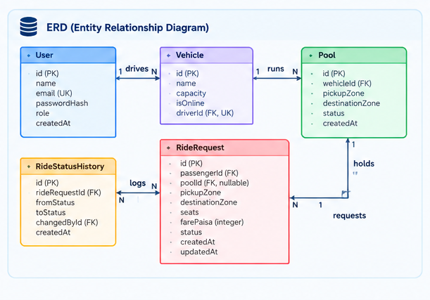

# Dhaka Tesla Pool
Share a seat. Split the fare. Survive Dhaka traffic.


| Live app | API | Demo video | Version |
|---|---|---|---|
| [dhaka-tesla-pool-ochre.vercel.app](https://dhaka-tesla-pool-ochre.vercel.app) | REPLACE_WITH_API_URL | REPLACE_WITH_VIDEO_LINK | `release/v1.0.0` |

A ride-pooling MVP for Dhaka. Passengers request a ride, and when it makes sense they share a three-seat Tesla (Jashim's "Bullet") with someone else. Each passenger sees only their own fare and status, the driver sees who is riding and what stage the trip is at, and Bullet's seat capacity can never be exceeded, even when two people grab the last seat at the same instant.


---

## Features

- **Passenger:** sign up and in, request a ride (pickup, destination, 1 to 3 seats), live fare estimate (alone vs. shared), status tracking, cancel while allowed, ride history.
- **Driver:** online/offline, waiting requests, accept, mark arrived / started / completed, current pool with seat meter, trip history.
- **Pooling:** a new request auto-joins a suitable open pool. Seats never exceed capacity. Every passenger gets an individual fare, recalculated when someone joins or cancels.
- **Safety:** JWT auth with roles, Zod validation, a state machine that rejects illegal transitions (`409`), ownership checks (other people's rides return `404`), append-only status history.
- **UX:** loading skeletons, empty and error states, live updates (4 s polling), animated status stepper and seat meter.
- **Ops:** `docker compose up` runs database, API (migrations and seed on start) and frontend. 16 automated tests.

## Screenshots

| Login | Passenger | Driver |
|---|---|---|
|  |  |  |

## Architecture



### ERD


## Tech stack and why

| Layer | Picked | Alternatives | Why it fits this MVP | Switch when |
|---|---|---|---|---|
| Database | PostgreSQL | MySQL, MongoDB | Relational data, plus **transactions and row locks** for seat counts | Stay on it (PostGIS later), add Redis for live locations |
| ORM | Prisma | Knex, Drizzle | Typed schema, migrations and seed built in, `$queryRaw` for the lock | Heavy custom SQL everywhere |
| Backend | Node + Express | NestJS, Fastify | About 15 routes, I wanted my own clear layering | Bigger team needs enforced structure |
| Auth | JWT + bcrypt | Sessions, Auth0 | Stateless, so the API scales horizontally | Refresh tokens in `httpOnly` cookies, MFA, social login |
| Validation | Zod | Joi, Yup | One schema validates and gives clear `400` messages | Framework change |
| Frontend | Next.js, Tailwind, Framer Motion | CRA/Vite, MUI | Routing out of the box, motion only where it carries meaning | Large UI with many developers |
| Live updates | 4 s polling | WebSockets, SSE | Simplest thing that feels live | First sign of load, see scaling doc |
| Tests | Jest + Supertest | Vitest | Tests the real HTTP layer and the real DB, where the dangerous bugs are | Vite toolchain |
| Hosting | Vercel, REPLACE_BACKEND_HOST, Neon | Fly.io, Railway | All free tier, deploy from Git | Cold starts or limits start to hurt |

REST over GraphQL: few resources, fixed screens, and status codes map directly to business errors.

## Getting started

**Prerequisites:** Node.js 20+, Git, and either Docker or a PostgreSQL database (local or a free Neon project).

### Environment variables (copy the `.example` files, never commit real values)

| File | Variables |
|---|---|
| `.env` (Docker) | `POSTGRES_USER`, `POSTGRES_PASSWORD`, `POSTGRES_DB`, `JWT_SECRET` |
| `backend/.env` | `DATABASE_URL`, `JWT_SECRET`, `PORT` (default 4000) |
| `backend/.env.test` | `DATABASE_URL` of a **separate** test database (tests delete data and refuse to run against the dev DB) |
| `frontend/.env.local` | `NEXT_PUBLIC_API_URL` (for example `http://localhost:4000`) |

### Option A: Docker (one command)

```bash
cp .env.example .env              # set JWT_SECRET and POSTGRES_PASSWORD
docker compose up --build         # open http://localhost:3000
```

`db` starts and turns healthy, then `api` applies migrations, seeds the cast and passes its health check, then `web` starts. Next.js proxies `/api/*` to the API, so only port 3000 is needed. Reset with `docker compose down -v`.

### Option B: Local

```bash
# backend
cd backend
cp .env.example .env              # edit DATABASE_URL and JWT_SECRET
npm install
npx prisma migrate deploy         # migrations
npm run seed                      # seed (idempotent, safe to repeat)
npm run dev                       # http://localhost:4000

# frontend (new terminal)
cd frontend
cp .env.example .env.local
npm install
npm run dev                       # http://localhost:3000
```

(PowerShell: use `Copy-Item` instead of `cp`.)

### Tests

```bash
cd backend
cp .env.test.example .env.test    # separate database!
npm test
```

16 tests against a real database (slow when the DB is remote, fast locally). They cover: capacity never exceeded, two concurrent requests for the last seat, illegal state transitions, Nusrat's and Rafiq's pooled fares, ownership (`404`/`403`/`401`), and cancellation rules.

## Demo credentials

All seeded accounts use password **`password123`**. The login page has one-click buttons.

| Person | Role | Email |
|---|---|---|
| Jashim | Driver (Bullet, 3 seats) | `jashim@teslapool.test` |
| Nusrat | Passenger | `nusrat@teslapool.test` |
| Rafiq | Passenger | `rafiq@teslapool.test` |
| Shirin | Passenger | `shirin@teslapool.test` |

**Try the story** (two browsers, one incognito): Jashim goes Online. Nusrat requests Banani to Mohakhali (৳85.00). Jashim accepts. Rafiq requests Banani to Gulshan 1, joins automatically (৳92.00), and Nusrat's fare drops to ৳68.00. Shirin asks for 2 seats and waits (only 1 left). Jashim marks arrived, starts, completes.

## How it works

**Zones and matching.** A fixed list of Dhaka zones with grid coordinates (km). Distance is Manhattan `|dx| + |dy|`, so it is whole km and testable by hand. A ride can join a pool only if the pool is open and online, the **pickup zone is the same**, every passenger's **destination is within 3 km** of the new one, and the seats fit. Nusrat (Banani to Mohakhali, 3 km) and Rafiq (Banani to Gulshan 1, 5 km) match because Mohakhali to Gulshan 1 is 2 km. Coordinates are invented for the MVP.

**Fare model** (money is stored as **integer paisa**, 1 taka = 100 paisa, because floating point drifts):

```
subtotal     = (4000 + 1500 x km) x seats
poolDiscount = floor(subtotal x 20 / 100)     only if 2+ passengers share
fare         = subtotal - poolDiscount
```

| | km | subtotal | discount | fare |
|---|---|---|---|---|
| Nusrat alone | 3 | 8500 | 0 | **8500** (৳85.00) |
| Nusrat pooled | 3 | 8500 | 1700 | **6800** (৳68.00) |
| Rafiq pooled | 5 | 11500 | 2300 | **9200** (৳92.00) |

Payment is cash (assumed). No gateway.

**Lifecycle:** `REQUESTED -> MATCHED -> DRIVER_ARRIVED -> STARTED -> COMPLETED`, plus `CANCELLED` (only before the driver arrives). The driver advances the **whole pool**, so all passengers move together. A ride with no pool stays `REQUESTED` (waiting). Diagram: [docs/architecture.md](docs/architecture.md#ride-lifecycle).

**Concurrency (the last seat).** Every change to a Tesla's seats first **locks that Tesla's row** (`SELECT ... FOR UPDATE`) in a transaction, then **re-reads** the seats (a check before the lock could be stale). Status changes use `UPDATE ... WHERE status = <old>`, so a stale write gives `409`. The loser of a race is not an error: the request was already saved, so it stays `REQUESTED`. A test fires two requests at once and asserts exactly one is matched. *At larger scale:* geo-sharded matching workers (one owner per Tesla), a queue, idempotency keys, optimistic concurrency. See [docs/scaling.md](docs/scaling.md).

## API overview

JSON over REST. Errors are always `{ "error": "message" }`.

| Method | Path | Who | Purpose |
|---|---|---|---|
| GET | `/health` | public | App and DB health |
| POST | `/api/auth/signup`, `/api/auth/login` | public | Get a token |
| GET | `/api/auth/me` | any | Current user |
| GET | `/api/rides/estimate` | passenger | Fare alone vs. pooled |
| POST | `/api/rides` | passenger | Request a ride (auto-joins an open pool) |
| GET | `/api/rides`, `/api/rides/:id` | passenger | Own history, one ride with timeline |
| POST | `/api/rides/:id/cancel` | passenger | Cancel (`REQUESTED` or `MATCHED` only) |
| PUT | `/api/driver/online` | driver | Go online or offline |
| GET | `/api/driver/requests` | driver | Waiting requests |
| POST | `/api/driver/requests/:id/accept` | driver | Accept (opens or joins a pool) |
| GET | `/api/driver/pool/current` | driver | Pool, passengers, seats |
| POST | `/api/driver/pools/:id/{arrive,start,complete}` | driver | Advance the whole pool |
| GET | `/api/driver/history` | driver | Completed trips |

## Project structure

```
backend/   prisma/ (schema, migrations, seed)
           src/domain/ (zones, fare, state machine)   src/services/ (rideService)
           src/routes/ (auth, rides, driver)          src/middleware/ (auth, errors)
           tests/
frontend/  src/app/ (login, passenger, driver)   src/components/   src/lib/
docs/      architecture.md, scaling.md
docker-compose.yml, .env.example
```

## Decisions, limitations, next steps

**Key decisions and assumptions**
- Passenger sign-up only. Drivers are seeded (driver onboarding is out of scope).
- One Tesla per driver, one open pool per Tesla. Joining is allowed only before the driver arrives.
- No cancel after the driver arrives (protects the driver and the other riders).
- Other people's rides return `404`, not `403`, so ids cannot be probed.
- Seats are counted from ride rows, not a stored counter (one source of truth).
- Business logic in services, not routes, which is what makes the tests meaningful.

**Known limitations**
- Polling, not push. JWT in `localStorage` (XSS trade-off), no refresh token.
- No rate limiting or `helmet`, CORS is open, logging is minimal.
- Zones and distances are invented, no real routing. The zone list exists in both frontend and backend.
- Driver cannot cancel or reassign a pool. No ratings or wallet.
- Tests are slow against a remote database. A free API host can be slow after being idle.

**Next improvements:** SSE/WebSockets, `GET /api/zones`, refresh tokens in `httpOnly` cookies, rate limiting and structured logs, idempotency keys, driver onboarding, a simulated wallet, CI on every pull request, PostGIS matching.

## AI usage

**Tools:** Claude (Anthropic) for planning, first drafts of code, tests, UI and Dockerfiles, debugging my terminal errors, and docs; plus official documentation. I ran, read and changed everything myself.

**Accepted:** locking the Tesla row with `SELECT ... FOR UPDATE`, re-reading seats after the lock, and the `WHERE status = <old>` guard. It solves the last-seat race in a few lines, and I verified it with a concurrent test.

**Changed:** the plan to develop on a local Docker Postgres. Docker Desktop hung my PC, so development and tests use a hosted Neon database (with a separate `test` branch), while `docker-compose.yml` stays so anyone can still run it with one command. Also, the first `app.js` mounted the driver routes before the JSON parser and was missing the error handler; running the app exposed it and I fixed it in `fix(api)` commits.

## Git workflow

Long-lived branches `master`, `pre-release`, `release/v1.0.0`; features on `feature/*` branches merged with `--no-ff`; commits follow `<type>(<scope>): <description>`. `pre-release` was cut after the MVP was integrated (docs, deployment checks), and `release/v1.0.0` from it is the version deployed and shown in the video.

## Demo video

REPLACE_WITH_VIDEO_LINK (6 minutes: problem and idea, architecture and decisions, product tour).
